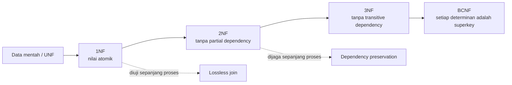
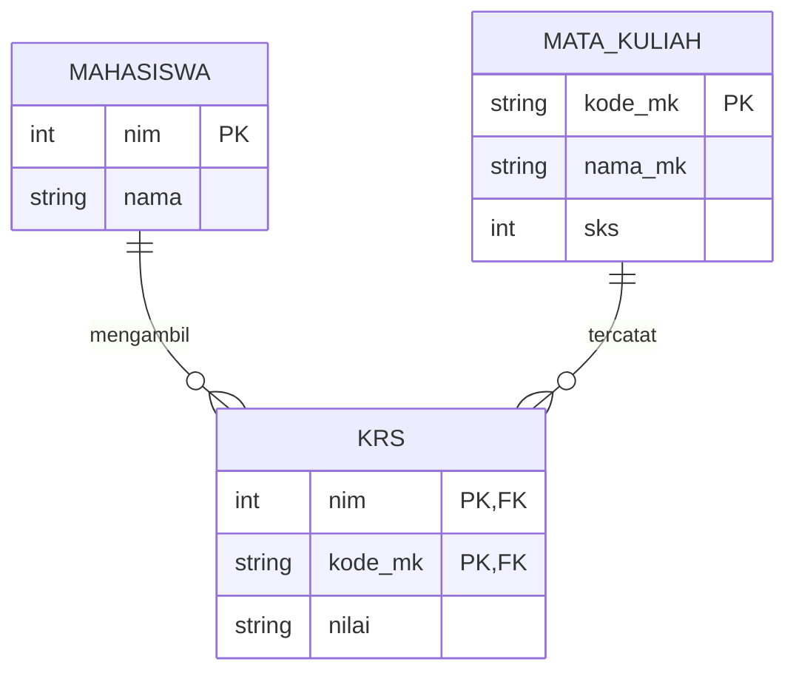
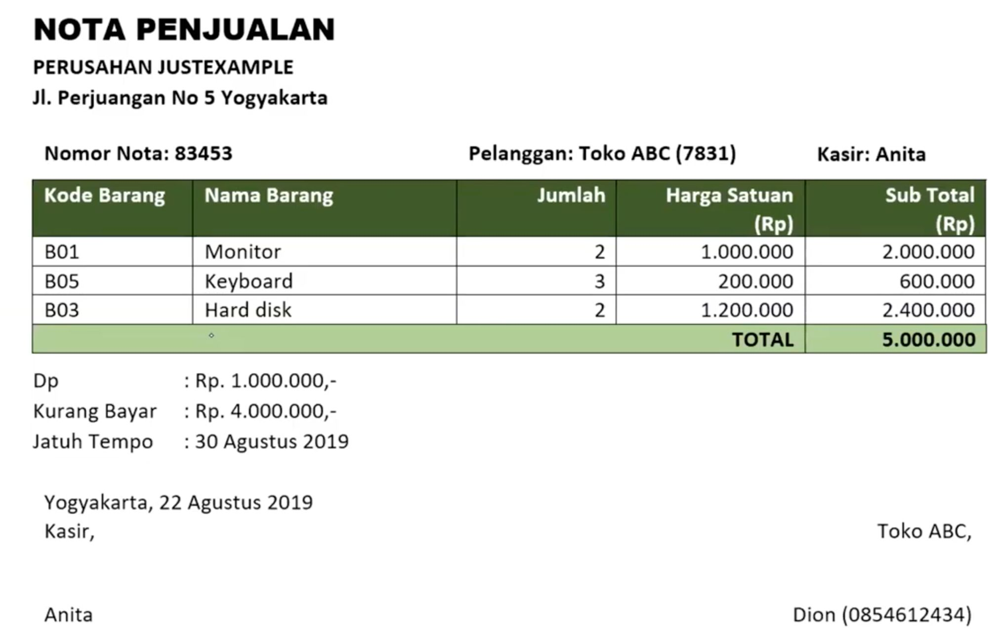
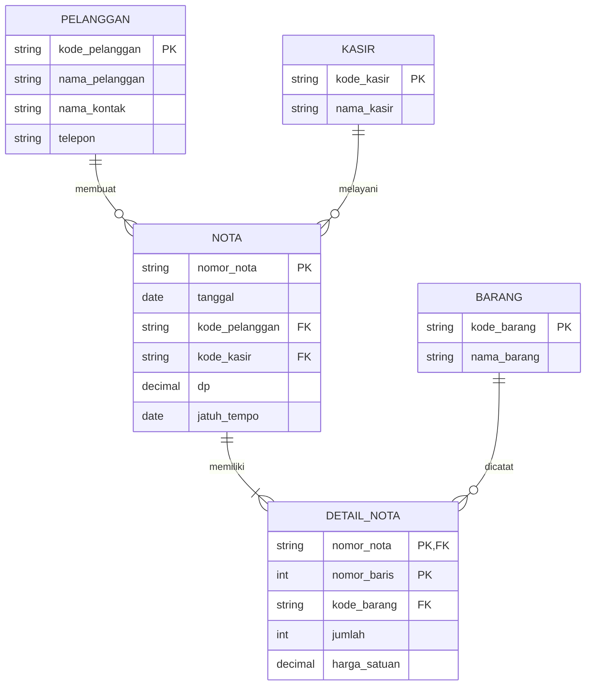

# Minggu 6 — Normalisasi Basis Data

**Mata kuliah:** Basis Data (SI2514010)
**Dosen pengampu:** Arif Wicaksono Septyanto, S.Kom., M.Kom.
**Sub-CPMK:** Mahasiswa mampu menganalisis kebutuhan dan merancang basis data yang konsisten (C4, C6).

## 1. Capaian Pembelajaran

Setelah mempelajari materi ini, mahasiswa diharapkan mampu:

1. menjelaskan tujuan normalisasi dan masalah pada tabel yang tidak normal;
2. mengidentifikasi candidate key dan functional dependency (FD);
3. membedakan full, partial, dan transitive dependency;
4. menormalisasi data dari UNF hingga 3NF/BCNF;
5. mengevaluasi dekomposisi berdasarkan lossless join dan dependency preservation;
6. menentukan primary key (PK) dan foreign key (FK) pada tabel hasil; dan
7. membuktikan bahwa informasi awal dapat dibentuk kembali menggunakan `JOIN`.

## 2. Peta Konsep



> **Inti normalisasi:** letakkan setiap fakta pada tabel yang tepat, satu kali, lalu hubungkan tabel dengan key.

## 3. Pengertian dan Tujuan Normalisasi

**Normalisasi** adalah proses mengorganisasi tabel relasional agar setiap fakta tersimpan secara logis, konsisten, dan dengan redundansi seminimal mungkin. Tabel besar diuraikan menjadi tabel yang lebih kecil berdasarkan ketergantungan antaratribut, kemudian dihubungkan menggunakan key.

Normalisasi bukan sekadar “memecah tabel”. Hasil pemecahan harus tetap menyimpan seluruh informasi dan mendukung aturan bisnis.

Tujuan normalisasi adalah menghasilkan tabel yang:

1. hanya memuat fakta yang sesuai dengan tema tabel;
2. memiliki redundansi sesedikit mungkin;
3. mudah dan aman ketika diubah;
4. mencegah kehilangan fakta secara tidak sengaja;
5. menjaga integritas serta konsistensi data; dan
6. mudah dikembangkan dan dipelihara.

Normalisasi berfokus pada **kebenaran desain logis**. Penghematan ruang dan peningkatan performa dapat menjadi dampak positif, tetapi bukan satu-satunya tujuan.

## 4. Mengapa Tabel Perlu Dinormalisasi?

| NIM | Nama  | KodeMK | MataKuliah | SKS | Nilai |
| --- | ----- | ------ | ---------- | --: | ----- |
| 1   | Ani   | A      | Agama      |   2 | A     |
| 1   | Ani   | B      | Bahasa     |   4 | B     |
| 2   | Ratna | A      | Agama      |   2 | B     |
| 2   | Ratna | B      | Bahasa     |   4 | B     |
| 3   | Ani   | A      | Agama      |   2 | C     |

Tabel tersebut mencampur fakta identitas mahasiswa, identitas mata kuliah, dan nilai mahasiswa. Akibatnya, nama mahasiswa, nama mata kuliah, dan SKS tersimpan berulang.

### 4.1 Insertion Anomaly

Misalkan program studi membuka mata kuliah baru **Basis Data (KodeMK C, 3 SKS)**, tetapi belum ada mahasiswa yang mengambilnya. Data mata kuliah tersebut tidak dapat dicatat dengan lengkap pada tabel ini karena setiap baris juga merepresentasikan KRS dan membutuhkan `NIM`, `Nama`, serta `Nilai`.

### 4.2 Update Anomaly

Misalkan jumlah SKS mata kuliah **Agama (KodeMK A)** berubah dari 2 menjadi 3 SKS. Ketiga baris berkode A harus diperbarui. Jika satu baris masih berisi 2 SKS, mata kuliah yang sama akan mempunyai dua nilai SKS yang berbeda.

### 4.3 Deletion Anomaly

Misalkan Ani dan Ratna membatalkan KRS mata kuliah **Bahasa (KodeMK B)**. Untuk mencatat pembatalan tersebut, kedua baris berkode B dihapus. Akibatnya, informasi bahwa KodeMK B adalah mata kuliah Bahasa dengan bobot 4 SKS juga hilang dari basis data, padahal mata kuliah tersebut masih tersedia dalam kurikulum.

Inilah **deletion anomaly**: penghapusan satu fakta yang memang ingin dihapus—fakta bahwa mahasiswa mengambil mata kuliah—secara tidak sengaja turut menghapus fakta lain yang masih diperlukan, yaitu identitas mata kuliah. Setelah dinormalisasi, pembatalan hanya menghapus baris pada tabel `KRS`, sedangkan data Bahasa tetap tersimpan pada tabel `MataKuliah`.

> **Cara cepat mengenali masalah:** tanyakan apakah satu fakta harus diperbarui di banyak baris, tidak dapat ditambahkan sendiri, atau ikut hilang ketika fakta lain dihapus.

## 5. Istilah Dasar

| Istilah           | Makna                                                  | Contoh                        |
| ----------------- | ------------------------------------------------------ | ----------------------------- |
| Relasi            | Tabel pada model relasional                            | `Mahasiswa`                 |
| Atribut           | Kolom pada tabel                                       | `nim`, `nama`             |
| Tuple             | Satu baris data                                        | `(1, Ani)`                  |
| Domain            | Himpunan nilai sah atribut                             | SKS berupa bilangan positif   |
| Superkey          | Atribut yang dapat mengidentifikasi tuple secara unik  | `{NIM, Nama}` jika NIM unik |
| Candidate key     | Superkey minimal                                       | `{NIM}`                     |
| Primary key       | Candidate key yang dipilih sebagai identitas utama     | `NIM`                       |
| Alternate key     | Candidate key yang tidak dipilih sebagai PK            | email unik                    |
| Composite key     | Key dengan lebih dari satu atribut                     | `(NIM, KodeMK)`             |
| Prime attribute   | Atribut yang menjadi bagian minimal satu candidate key | NIM pada key gabungan         |
| Non-key attribute | Atribut yang bukan bagian candidate key                | `Nama`                      |
| Determinan        | Sisi kiri FD yang menentukan atribut lain              | NIM pada`NIM → Nama`       |
| Dekomposisi       | Pemecahan relasi menjadi relasi lebih kecil            | Mahasiswa, MataKuliah, KRS    |

## 6. Functional Dependency

Bagian ini membahas **hubungan penentu antaratribut**. Tujuannya adalah mengetahui suatu informasi seharusnya disimpan bersama atribut apa. Hasil analisis ini digunakan ketika memecah tabel pada proses:

- **2NF (Second Normal Form/Bentuk Normal Kedua):** menghilangkan atribut yang hanya bergantung pada sebagian composite key; dan
- **3NF (Third Normal Form/Bentuk Normal Ketiga):** menghilangkan atribut non-key yang bergantung pada atribut non-key lainnya.

Kedua tahap tersebut akan dibahas lebih lengkap pada Bagian 12 dan 13.

### 6.1 Definisi dan Notasi

**Functional dependency (FD)** atau ketergantungan fungsional berarti nilai suatu atribut dapat menentukan nilai atribut lain secara pasti.

FD ditulis `X → Y` dan dibaca **“X menentukan Y”**. Jika nilai X diketahui, hanya ada satu nilai Y yang sesuai. X disebut **determinan** atau atribut penentu.

```text
NIM → Nama
KodeMK → MataKuliah, SKS
(NIM, KodeMK) → Nilai
```

- `NIM → Nama`: jika NIM diketahui, nama mahasiswa dapat diketahui.
- `KodeMK → MataKuliah, SKS`: jika kode mata kuliah diketahui, nama mata kuliah dan jumlah SKS dapat diketahui.
- `(NIM, KodeMK) → Nilai`: nilai baru dapat diketahui jika NIM **dan** KodeMK diketahui.

Mengapa Nilai harus ditentukan oleh NIM **dan** KodeMK?

- Jika hanya diketahui `NIM = 1`, terdapat dua kemungkinan Nilai: nilai huruf **A** untuk mata kuliah berkode A dan nilai huruf **B** untuk mata kuliah berkode B. Jadi, NIM saja belum menentukan satu Nilai.
- Jika hanya diketahui `KodeMK = A`, terdapat tiga kemungkinan Nilai: mahasiswa bernomor 1 memperoleh **A**, mahasiswa bernomor 2 memperoleh **B**, dan mahasiswa bernomor 3 memperoleh **C**. Jadi, KodeMK saja juga belum menentukan satu Nilai.
- Jika keduanya diketahui, misalnya `NIM = 1` dan `KodeMK = A`, hanya ada satu baris yang sesuai. Dari baris tersebut dapat diketahui bahwa mahasiswa itu memperoleh **nilai huruf A**.

Dengan demikian, `(NIM, KodeMK) → Nilai` dibaca: **kombinasi seorang mahasiswa dan satu mata kuliah menentukan satu nilai**.

#### Cara Membaca Arah Panah

```text
NIM → Nama        benar
Nama → NIM        belum tentu benar
```

`NIM → Nama` benar karena satu NIM hanya dimiliki satu mahasiswa. Sebaliknya, `Nama → NIM` belum tentu benar karena dua mahasiswa dapat memiliki nama yang sama. Pada tabel contoh, NIM 1 dan NIM 3 sama-sama bernama Ani.

> **Pertanyaan bantu:** “Jika nilai di sebelah kiri diketahui, apakah nilai di sebelah kanan pasti hanya satu?” Jika ya, kemungkinan terdapat functional dependency.

### 6.2 FD Berasal dari Aturan Bisnis

FD harus berlaku untuk **semua data yang sah**, bukan hanya cocok dengan beberapa baris yang sedang terlihat.

Misalkan pada hari ini tabel hanya berisi:

| NIM | Nama |
| --- | ---- |
| 101 | Ani  |
| 102 | Budi |

Dari dua baris tersebut, nama tampak dapat menentukan NIM. Namun, besok dapat didaftarkan mahasiswa lain:

| NIM | Nama |
| --- | ---- |
| 103 | Ani  |

Sekarang nama Ani berhubungan dengan dua NIM, yaitu 101 dan 103. Karena kampus memperbolehkan mahasiswa memiliki nama yang sama, `Nama → NIM` **bukan** FD yang benar. Sebaliknya, `NIM → Nama` benar karena aturan kampus menetapkan satu NIM hanya untuk satu mahasiswa.

Jadi, FD ditentukan dengan menanyakan **“apakah hubungan ini selalu berlaku menurut aturan kampus?”**, bukan hanya **“apakah hubungan ini terlihat benar pada data saat ini?”**

Aturan bisnis pada contoh ini adalah:

- satu NIM hanya dimiliki satu mahasiswa;
- dua mahasiswa boleh memiliki nama yang sama;
- satu kode mata kuliah menentukan satu nama dan jumlah SKS; dan
- dalam kasus ini, satu mahasiswa memiliki paling banyak satu nilai per mata kuliah.

Dari aturan tersebut diperoleh:

| Informasi yang diketahui | Informasi yang dapat ditentukan           | FD                            |
| ------------------------ | ----------------------------------------- | ----------------------------- |
| NIM                      | Nama mahasiswa                            | `NIM → Nama`               |
| KodeMK                   | MataKuliah dan SKS                        | `KodeMK → MataKuliah, SKS` |
| NIM dan KodeMK           | Nilai mahasiswa pada mata kuliah tersebut | `(NIM, KodeMK) → Nilai`    |

### 6.3 Jenis Ketergantungan

Jenis ketergantungan berikut membantu menentukan bentuk normal tabel.

#### A. Full Functional Dependency

**Full functional dependency** terjadi ketika atribut memerlukan **seluruh bagian composite key** agar nilainya dapat ditentukan.

```text
(NIM, KodeMK) → Nilai
```

NIM saja tidak cukup dan KodeMK saja juga tidak cukup. Kombinasi keduanya diperlukan untuk menentukan satu nilai.

#### B. Partial Dependency

**Partial dependency** terjadi ketika atribut non-key terlihat bergantung pada composite key, tetapi sebenarnya cukup ditentukan oleh **sebagian** key tersebut.

```text
(NIM, KodeMK) → Nama
tetapi sebenarnya:
NIM → Nama
```

Nama tidak memerlukan KodeMK. Cukup dengan NIM, nama mahasiswa sudah dapat diketahui. Ketergantungan parsial dihilangkan untuk mencapai **2NF** dengan memindahkan `NIM` dan `Nama` ke tabel Mahasiswa.

#### C. Transitive Dependency

**Transitive dependency** terjadi ketika key menentukan atribut non-key pertama, lalu atribut tersebut menentukan atribut non-key lainnya. Ketergantungannya membentuk rantai.

```text
NomorNota → KodePelanggan
KodePelanggan → NamaPelanggan

sehingga:
NomorNota → NamaPelanggan secara tidak langsung
```

Nama pelanggan sebenarnya ditentukan oleh KodePelanggan, bukan langsung oleh NomorNota. Ketergantungan transitif dihilangkan untuk mencapai **3NF** dengan memindahkan data pelanggan ke tabel Pelanggan.

| Jenis                 | Ciri                                         | Tindakan             |
| --------------------- | -------------------------------------------- | -------------------- |
| Full dependency       | Bergantung pada seluruh composite key        | Dipertahankan        |
| Partial dependency    | Bergantung hanya pada sebagian composite key | Dihilangkan pada 2NF |
| Transitive dependency | Bergantung pada key melalui atribut non-key  | Dihilangkan pada 3NF |

## 7. Dekomposisi yang Baik

### 7.1 Lossless-Join Decomposition

Dekomposisi disebut **lossless** jika tabel hasil dapat di-`JOIN` untuk membentuk kembali informasi semula secara tepat: tidak ada data hilang dan tidak muncul tuple palsu (*spurious tuples*).

| A  | B  |   C |
| -- | -- | --: |
| a1 | b1 | 100 |
| a2 | b2 | 200 |
| a3 | b3 | 300 |
| a4 | b2 | 400 |
| a4 | b2 | 500 |

Jika dipecah menjadi `AB(A, B)` dan `BC(B, C)`, nilai `b2` berpasangan dengan beberapa A dan C. Ketika di-`JOIN`, muncul pasangan yang tidak ada pada tabel awal, misalnya `(a2, b2, 400)` dan `(a4, b2, 200)`. Inilah **lossy decomposition**.

Untuk dekomposisi biner `R → R1 dan R2`, kondisi praktis lossless adalah atribut irisan `R1 ∩ R2` menentukan seluruh atribut `R1` atau seluruh atribut `R2`.

Contoh aman:

```text
Mahasiswa(NIM, Nama)
MataKuliah(KodeMK, MataKuliah, SKS)
KRS(NIM, KodeMK, Nilai)
```



### 7.2 Dependency Preservation

Dekomposisi menjaga dependency jika seluruh FD penting dapat diperiksa pada tabel hasil tanpa `JOIN` rumit.

- `NIM → Nama` dijaga oleh Mahasiswa;
- `KodeMK → MataKuliah, SKS` dijaga oleh MataKuliah;
- `(NIM, KodeMK) → Nilai` dijaga oleh KRS.

Idealnya hasil dekomposisi **lossless** sekaligus **dependency-preserving**. Lossless wajib; dependency preservation sangat diinginkan agar constraint mudah ditegakkan.

## 8. Ringkasan Bentuk Normal

| Bentuk | Syarat utama                                     | Masalah yang dihilangkan                   |
| ------ | ------------------------------------------------ | ------------------------------------------ |
| UNF    | Ada repeating group/multivalue                   | Belum berbentuk relasi yang baik           |
| 1NF    | Setiap sel atomik dan baris dapat diidentifikasi | Repeating group/multivalue                 |
| 2NF    | 1NF + tidak ada partial dependency               | Ketergantungan pada sebagian composite key |
| 3NF    | 2NF + tidak ada transitive dependency non-key    | Ketergantungan non-key melalui non-key     |
| BCNF   | Setiap determinan adalah superkey                | Anomali yang masih mungkin lolos dari 3NF  |

Urutannya kumulatif: tabel 3NF pasti telah memenuhi 2NF dan 1NF.

## 9. Studi Kasus Nota Penjualan

Slide menggunakan bukti transaksi berikut sebagai sumber kebutuhan data.



### 9.1 Mengidentifikasi Atribut

```text
nomor_nota, tanggal,
kode_pelanggan, nama_pelanggan, nama_kontak, telepon,
kode_kasir, nama_kasir,
kode_barang, nama_barang, jumlah, harga_satuan,
dp, jatuh_tempo, subtotal, total, kurang_bayar
```

Pisahkan fakta berdasarkan tingkat peristiwa (*grain*): satu baris per pelanggan, kasir, barang, nota, dan barang yang tercantum pada nota.

### 9.2 Atribut Turunan

```text
subtotal    = jumlah × harga_satuan
total       = jumlah seluruh subtotal pada satu nota
kurangBayar = total − dp
```

Atribut turunan tidak selalu harus disimpan. Jika disimpan demi audit atau performa, tentukan mekanisme yang menjaga konsistensinya.

> `harga_satuan` pada DetailNota layak disimpan sebagai **harga transaksi** karena dapat berbeda dari harga barang saat ini.

## 10. Unnormalized Form (UNF)

| NomorNota | Pelanggan | Kasir | DaftarBarang                                                                              |
| --------- | --------- | ----- | ----------------------------------------------------------------------------------------- |
| 83453     | Toko ABC  | Anita | (B01, Monitor, 2, 1.000.000); (B05, Keyboard, 3, 200.000); (B03, Hard Disk, 2, 1.200.000) |

`DaftarBarang` memuat kelompok berulang. Bentuk `Barang1`, `Barang2`, `Barang3` juga UNF karena struktur kolom harus berubah ketika item bertambah.

## 11. First Normal Form (1NF)

Syarat 1NF:

1. setiap sel berisi satu nilai atomik sesuai kebutuhan sistem;
2. tidak ada repeating group atau multivalue;
3. setiap baris dapat diidentifikasi secara unik; dan
4. setiap kolom menggunakan satu domain yang konsisten.

| NomorNota | KodeBarang | NamaBarang | Jumlah | HargaSatuan |
| --------- | ---------- | ---------- | -----: | ----------: |
| 83453     | B01        | Monitor    |      2 |     1000000 |
| 83453     | B05        | Keyboard   |      3 |      200000 |
| 83453     | B03        | Hard Disk  |      2 |     1200000 |

Candidate key detail dapat berupa `(NomorNota, KodeBarang)` jika satu barang hanya boleh muncul sekali per nota. Jika boleh muncul berulang, gunakan `(NomorNota, NomorBaris)`.

1NF belum menghilangkan seluruh redundansi; data nota, pelanggan, kasir, dan barang masih berulang.

## 12. Second Normal Form (2NF)

Syarat 2NF adalah telah 1NF dan setiap atribut non-key bergantung penuh pada seluruh candidate key.

```text
NomorNota → Tanggal, KodePelanggan, NamaPelanggan,
             KodeKasir, NamaKasir, DP, JatuhTempo
KodeBarang → NamaBarang
(NomorNota, KodeBarang) → Jumlah, HargaSatuan
```

Ketergantungan pada `NomorNota` saja atau `KodeBarang` saja adalah partial dependency. Dekomposisi awal:

```text
NotaSementara(NomorNota, Tanggal, KodePelanggan, NamaPelanggan,
              KodeKasir, NamaKasir, DP, JatuhTempo)
Barang(KodeBarang, NamaBarang)
DetailNota(NomorNota, KodeBarang, Jumlah, HargaSatuan)
```

> Tabel dengan candidate key satu atribut otomatis bebas partial dependency, tetapi belum tentu memenuhi 3NF.

## 13. Third Normal Form (3NF)

Syarat 3NF adalah telah 2NF dan tidak ada atribut non-key yang bergantung transitif pada candidate key melalui atribut non-key lain.

```text
NomorNota → KodePelanggan
KodePelanggan → NamaPelanggan, NamaKontak, Telepon

NomorNota → KodeKasir
KodeKasir → NamaKasir
```

Hasil dekomposisi:

```text
Pelanggan(KodePelanggan, NamaPelanggan, NamaKontak, Telepon)
Kasir(KodeKasir, NamaKasir)
Barang(KodeBarang, NamaBarang)
Nota(NomorNota, Tanggal, KodePelanggan, KodeKasir, DP, JatuhTempo)
DetailNota(NomorNota, NomorBaris, KodeBarang, Jumlah, HargaSatuan)
```

Definisi formal 3NF: untuk setiap FD nontrivial `X → A`, `X` adalah superkey atau `A` adalah prime attribute.

## 14. Boyce–Codd Normal Form (BCNF)

Suatu relasi memenuhi BCNF jika untuk setiap FD nontrivial `X → Y`, `X` merupakan superkey. BCNF lebih ketat daripada 3NF.

### Contoh 3NF tetapi Bukan BCNF

```text
(Mahasiswa, MataKuliah) → Dosen
Dosen → MataKuliah
```

Candidate key adalah `(Mahasiswa, MataKuliah)` dan `(Mahasiswa, Dosen)`. `Dosen → MataKuliah` memenuhi 3NF karena MataKuliah prime, tetapi melanggar BCNF karena Dosen bukan superkey.

Dekomposisi BCNF:

```text
Mengajar(Dosen, MataKuliah)
PesertaDosen(Mahasiswa, Dosen)
```

Pada kasus tertentu BCNF dapat tidak menjaga semua dependency; 3NF yang lossless dan dependency-preserving dapat dipilih dengan alasan yang terdokumentasi.

## 15. Skema Akhir Nota Penjualan



- PK Pelanggan: `kode_pelanggan`;
- PK Kasir: `kode_kasir`;
- PK Barang: `kode_barang`;
- PK Nota: `nomor_nota`;
- PK DetailNota: `(nomor_nota, nomor_baris)`;
- Nota memiliki FK ke Pelanggan dan Kasir; dan
- DetailNota memiliki FK ke Nota dan Barang.

## 16. Contoh Implementasi SQL

```sql
CREATE TABLE Pelanggan (
    kode_pelanggan VARCHAR(10) PRIMARY KEY,
    nama_pelanggan VARCHAR(100) NOT NULL,
    nama_kontak VARCHAR(100),
    telepon VARCHAR(25)
);

CREATE TABLE Kasir (
    kode_kasir VARCHAR(10) PRIMARY KEY,
    nama_kasir VARCHAR(100) NOT NULL
);

CREATE TABLE Barang (
    kode_barang VARCHAR(10) PRIMARY KEY,
    nama_barang VARCHAR(100) NOT NULL
);

CREATE TABLE Nota (
    nomor_nota VARCHAR(20) PRIMARY KEY,
    tanggal DATE NOT NULL,
    kode_pelanggan VARCHAR(10) NOT NULL,
    kode_kasir VARCHAR(10) NOT NULL,
    dp DECIMAL(14,2) NOT NULL DEFAULT 0,
    jatuh_tempo DATE,
    CONSTRAINT chk_nota_dp CHECK (dp >= 0),
    CONSTRAINT fk_nota_pelanggan FOREIGN KEY (kode_pelanggan)
      REFERENCES Pelanggan(kode_pelanggan),
    CONSTRAINT fk_nota_kasir FOREIGN KEY (kode_kasir)
      REFERENCES Kasir(kode_kasir)
);

CREATE TABLE DetailNota (
    nomor_nota VARCHAR(20) NOT NULL,
    nomor_baris INT NOT NULL,
    kode_barang VARCHAR(10) NOT NULL,
    jumlah INT NOT NULL,
    harga_satuan DECIMAL(14,2) NOT NULL,
    PRIMARY KEY (nomor_nota, nomor_baris),
    CONSTRAINT uq_detail_barang UNIQUE (nomor_nota, kode_barang),
    CONSTRAINT chk_detail_jumlah CHECK (jumlah > 0),
    CONSTRAINT chk_detail_harga CHECK (harga_satuan >= 0),
    CONSTRAINT fk_detail_nota FOREIGN KEY (nomor_nota)
      REFERENCES Nota(nomor_nota),
    CONSTRAINT fk_detail_barang FOREIGN KEY (kode_barang)
      REFERENCES Barang(kode_barang)
);
```

Hapus `uq_detail_barang` jika aturan bisnis mengizinkan barang yang sama muncul pada beberapa baris dalam satu nota.

## 17. Membuktikan Lossless Join

```sql
SELECT n.nomor_nota, n.tanggal,
       p.kode_pelanggan, p.nama_pelanggan,
       k.kode_kasir, k.nama_kasir,
       d.nomor_baris, b.kode_barang, b.nama_barang,
       d.jumlah, d.harga_satuan,
       d.jumlah * d.harga_satuan AS subtotal
FROM Nota AS n
JOIN Pelanggan AS p ON p.kode_pelanggan = n.kode_pelanggan
JOIN Kasir AS k ON k.kode_kasir = n.kode_kasir
JOIN DetailNota AS d ON d.nomor_nota = n.nomor_nota
JOIN Barang AS b ON b.kode_barang = d.kode_barang
ORDER BY n.nomor_nota, d.nomor_baris;
```

```sql
SELECT n.nomor_nota,
       SUM(d.jumlah * d.harga_satuan) AS total,
       n.dp,
       SUM(d.jumlah * d.harga_satuan) - n.dp AS kurang_bayar
FROM Nota AS n
JOIN DetailNota AS d ON d.nomor_nota = n.nomor_nota
GROUP BY n.nomor_nota, n.dp;
```

Verifikasi bahwa jumlah dan makna baris sama dengan sumber, tidak ada baris hilang, tidak ada tuple palsu, dan nilai agregat sama dengan nota.

## 18. Prosedur Normalisasi Sistematis

1. Tentukan ruang lingkup dan aturan bisnis.
2. Kumpulkan atribut dari formulir, laporan, atau kebutuhan pengguna.
3. Tentukan *grain*: satu baris merepresentasikan apa?
4. Tentukan semua candidate key.
5. Tuliskan FD berdasarkan aturan bisnis.
6. Hilangkan repeating group untuk 1NF.
7. Hilangkan partial dependency untuk 2NF.
8. Hilangkan transitive dependency untuk 3NF.
9. Periksa setiap determinan untuk BCNF.
10. Tentukan PK, FK, `UNIQUE`, `NOT NULL`, dan `CHECK`.
11. Uji lossless join dan dependency preservation.
12. Cocokkan dengan ERD, transaksi, dan laporan yang dibutuhkan.

| Komponen analisis                      | Isian |
| -------------------------------------- | ----- |
| Nama relasi awal                       | ...   |
| Makna satu baris (*grain*)           | ...   |
| Daftar atribut                         | ...   |
| Candidate key                          | ...   |
| Functional dependency                  | ...   |
| Pelanggaran bentuk normal              | ...   |
| Hasil dekomposisi                      | ...   |
| PK dan FK                              | ...   |
| Bukti lossless/dependency preservation | ...   |

## 19. Kesalahan Umum

1. Menentukan FD hanya dari data contoh, bukan aturan bisnis.
2. Menulis arah FD terbalik.
3. Memecah tabel tanpa menentukan candidate key.
4. Menganggap 1NF telah menghilangkan seluruh redundansi.
5. Menerapkan 2NF tanpa memeriksa composite candidate key.
6. Mengira semua tabel harus menggunakan surrogate key.
7. Memindahkan atribut tanpa membawa key penghubung.
8. Menghasilkan dekomposisi lossy atau tuple palsu.
9. Tidak menentukan PK, FK, dan constraint.
10. Menganggap tabel dengan banyak kolom pasti tidak normal.
11. Menghapus harga transaksi karena ada harga barang saat ini.
12. Menyimpan atribut turunan tanpa mekanisme konsistensi.
13. Melakukan denormalisasi sebelum masalah performa diukur.

## 20. Kapan Normalisasi Berhenti?

Untuk sistem transaksi, target praktis umumnya 3NF atau BCNF. Bentuk 4NF dan 5NF digunakan ketika terdapat multivalued dependency atau join dependency khusus.

Berhentilah ketika setiap tabel memiliki satu tema jelas, anomali penting telah dihilangkan, dekomposisi lossless, dependency penting terjaga, dan skema mendukung kebutuhan sistem.

**Denormalisasi** menambahkan redundansi secara sadar demi performa. Lakukan hanya setelah pengukuran, dokumentasikan alasannya, dan sediakan mekanisme konsistensi.

## 21. Contoh Terbimbing: Mahasiswa–Mata Kuliah

```text
R(NIM, Nama, KodeMK, MataKuliah, SKS, Nilai)
```

1. Satu baris berarti nilai seorang mahasiswa pada satu mata kuliah.
2. Candidate key: `(NIM, KodeMK)`.
3. FD: `NIM → Nama`, `KodeMK → MataKuliah, SKS`, `(NIM, KodeMK) → Nilai`.
4. Tabel telah 1NF karena nilainya atomik.
5. Terdapat partial dependency, sehingga belum 2NF.
6. Hasil dekomposisi:

```text
Mahasiswa(NIM, Nama)
MataKuliah(KodeMK, MataKuliah, SKS)
KRS(NIM, KodeMK, Nilai)
```

Hasil memenuhi 3NF dan BCNF untuk FD yang diberikan karena setiap determinan pada masing-masing tabel merupakan key.

## 22. Latihan

### Latihan A — Pemahaman Konsep

1. Jelaskan tiga anomali pada tabel mahasiswa–mata kuliah.
2. Mengapa nama yang unik pada lima baris belum membuktikan `Nama → NIM`?
3. Bedakan superkey, candidate key, dan primary key.
4. Bedakan partial dependency dan transitive dependency.
5. Mengapa dekomposisi harus diuji dengan `JOIN`?

### Latihan B — Normalisasi Nota

1. Tentukan *grain* tabel nota pada bentuk 1NF.
2. Tuliskan candidate key dan seluruh FD.
3. Tandai partial dependency sebelum 2NF.
4. Tandai transitive dependency sebelum 3NF.
5. Gambar skema 3NF beserta PK dan FK.
6. Jelaskan mengapa harga transaksi disimpan pada DetailNota.
7. Tulis query untuk menghitung total dan kurang bayar.

### Latihan C — Uji Lossless/Lossy

Diberikan `R(A, B, C)` dengan FD `A → B`.

1. Apakah `R1(A, B)` dan `R2(A, C)` lossless? Jelaskan.
2. Apakah `R1(A, B)` dan `R2(B, C)` selalu lossless? Jelaskan.
3. Buat data kecil yang menunjukkan tuple palsu.

## 23. Kuis Formatif

1. Nilai tunggal dalam setiap sel merupakan syarat bentuk normal apa?
2. Dependency pada sebagian composite key disebut apa?
3. Dependency non-key melalui non-key disebut apa?
4. Apa yang dimaksud determinan?
5. Apa arti lossless join?
6. Mengapa dependency preservation penting?
7. Dalam BCNF, setiap determinan harus berupa apa?
8. Apakah tabel dengan key tunggal otomatis 3NF?

<details>
<summary><strong>Kunci jawaban singkat</strong></summary>

1. 1NF.
2. Partial dependency.
3. Transitive dependency.
4. Atribut/himpunan atribut pada sisi kiri FD.
5. Dapat digabung kembali tanpa kehilangan data atau menambah tuple palsu.
6. Agar constraint dapat diperiksa langsung pada tabel hasil.
7. Superkey.
8. Tidak; transitive dependency masih mungkin ada.

</details>

## 24. Rangkuman

- Normalisasi menempatkan setiap fakta pada tabel yang tepat.
- Candidate key dan FD menjadi dasar dekomposisi.
- 1NF menghilangkan repeating group dan multivalue.
- 2NF menghilangkan partial dependency.
- 3NF menghilangkan transitive dependency non-key.
- BCNF mengharuskan setiap determinan menjadi superkey.
- Dekomposisi harus lossless dan sebisa mungkin menjaga dependency.
- PK, FK, dan constraint mengimplementasikan aturan hasil normalisasi.
- `JOIN` memverifikasi bahwa informasi tetap dapat direkonstruksi.

## 25. Asesmen dan Praktikum

Asesmen mencakup identifikasi anomali, candidate key, FD, proses UNF–3NF/BCNF, penentuan PK/FK, serta pembuktian lossless join.

[Praktikum Minggu 6 — Normalisasi Basis Data](<../script/Week%206/Praktikum%20Week%206%20-%20Normalisasi%20Basis%20Data.md>)

## Referensi

1. Slide Week 6 — *Normalisasi*.
2. Bagui, S. & Earp, R. (2023). *Database Design Using Entity-Relationship Diagrams*.
3. Elmasri, R. & Navathe, S. B. *Fundamentals of Database Systems*.
4. Silberschatz, A., Korth, H. F., & Sudarshan, S. *Database System Concepts*.
5. RPS SI2514010 — Basis Data.
